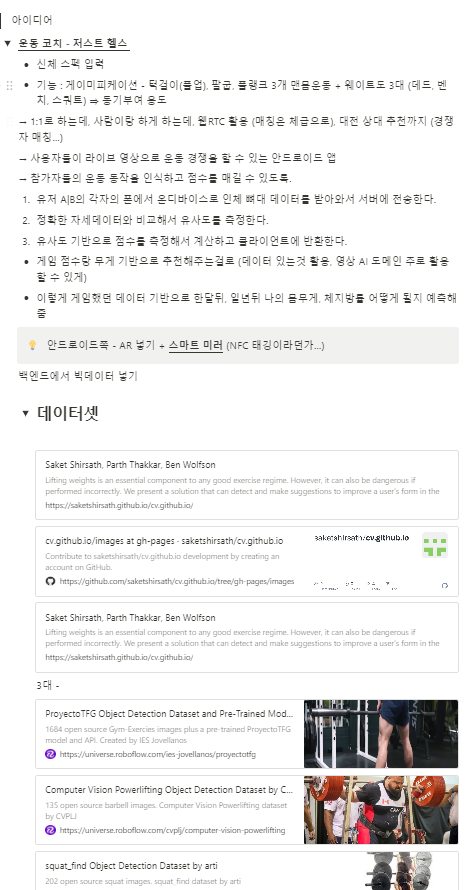
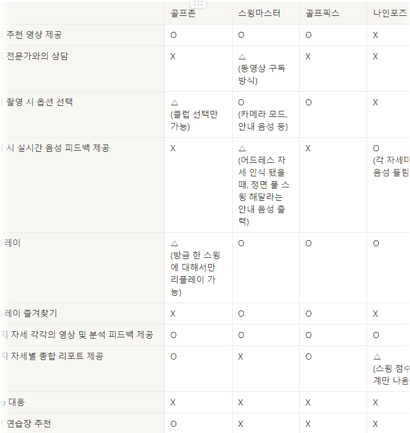

---
# 파일 이름이 html의 경로가 되는데 ₂같은 것이 안먹힘
# 카테고리 등에는 다 적용되는데 이름에는 안먹히니까 참고
layout: post
title: 01. 시작부터 마무리까지
categories: [project, Ijonsabae]
tags: [blog]
---

- toc
{:toc .large-only}

## 시작
기획부터 쉽지 않았다..

무언가 AI를 적용하는 프로젝트를 진행해야 했는데, Android 휴대폰에 OnDevice로 탑재가 가능한 성능 정도로도 작동이 되는 주제여야 했고,

6인이라는 팀의 규모로 진행하는 것이 납득할만한 규모에, 이제까지 나왔던 것들과 차별성을 지녀야 했다.

{:.lead}
극히 일부인 아이디어 상의 내용
{:.figure}

밤에도 모여서 상의를 지속한 결과 골프 자세 교정 앱이라는 아이디어가 나왔다.

보다 주제의 설득력을 높이고자 설문조사를 진행함과 동시에, 타 기존 서비스들을 체험하며 기능들을 조사했다.

{:.lead}
테이블로 조사한 내용 정리
{:.figure}

이를 이 모든 앱들의 기능을 아우를 수 있는 골프 앱을 만들기로 했고,

1. 어드레스 등 자세를 실시간으로 분석해서 시각적으로 피드백 제공 및 분석 결과 TTS 활용
2. 모션 인식으로 팔을 저어서 피드백 다이얼로그 닫기
3. 갤럭시 ZFlip 최적화 반응형 UI 제공

이외에도 즐겨찾기 기능 등 기타 타 앱에는 없거나 애매했던 기능들을 추가해서 차별점을 가져가고자 했다.

## 어려웠던 점
1. ### DI와 Architecture

    이번 프로젝트에서는 Hilt를 이용한 DI, Clean Architecture를 기반으로 한 Multi Module을 계획했다.

    둘 다 한번도 해본 적이 없었던 것이었기 때문에,

    기존이라면 간단하게 해결했을 코드도 어디에 작성해야 할 지, 이런 것들이 확신이 없어 별 것 아닌 코드에도 많은 시간을 고민해야 했다.

    또한, Android에서 Navigation을 이용해서 supportFragmentManager 없이 화면 이동을 진행했다

    Navigation으로 arg를 던져줄 때, Primitive 자료형을 제외하고 객체의 경우 Serializable or Parcelable 객체만 전달할 수 있었는데, 

    이 때 Domain 영역은 Kotlin Only의 영역으로 다른 Android와 같은 의존성이 있어서는 안됐다

    다만 Data 영역에서 API 호출 등을 통해 가져온 Data는 Domain을 거쳐서 Presentation 영역으로 전달되게 되는데,

    Parcelable은 Android 의존성이 있는 자료구조였고, Kotlinx의 Serializable은 앱 내에서 공유하기 위한 Serializable이 아니었기 때문에 Args로 전달할 수가 없었다.

    어쩔 수 없이 Presentation에 Parcelable의 Model을 만들고 Mapper를 만들어 변환하는 과정을 거쳤다.

    또한 Paging3, Room 등 Android 의존성이 필요한 것들의 Data Type 등을 위해서 쓸 필요가 있거나, Presentation 영역으로 그대로 전달해야 하는 경우, Domain Layer에서 이를 어떻게 처리할 것인가도 문제였다.

    이는 Dependency를 추가하는 것을 잘 보면 "without Android"와 같은 주석이 작성된 것이 있고, 이와 같은 Android 의존성이 없는 것으로 Dependency를 추가시켜서 해결할 수 있었다.

2. ### 반응형 레이아웃

    플립 최적화를 위해서는 디바이스가 접혔는지를 감지해서 접혔을 때와 접히지 않았을 떄 각각의 화면을 제공할 필요가 있었다.

    기본적으로 Android는 Constraint Layout, Linear Layout 등을 기반으로 돌아가고, 반응형 또한 크게 다르지는 않는데,

    시각적으로 모션을 주어서 UI를 예쁘게 꾸밀 필요가 있었다.

    그런데 Samsung Developer에서 내려받은 반응형 레이아웃 예제는 버전이 오래되어 맞지 않아 제대로 쓸 수가 없었다.

    계속된 구글링으로 자료를 서치하여 돌아가는 얘제를 구할 수 있었고, Value Animator를 통해 모션 효과를 줄 수 있는 것을 확인헀다.

    다만 이것들을 확인했어도, 구현하는 것이 쉽지 않았다.

    결국 이러한 레이아웃을 코드로 녹여내야 했는데,

    xml 파일에서 Layout을 보면서 작업하는 것이 아니어서, 눈 감고 그림 그리는 것 같았다.

    또한 단순히 레이아웃을 바꾸는게 아니라, 정확히는 ValueAnimator로 Layout을 적용했을 때 위치할 곳으로 View에 Animation 효과를 준 다음 끝났을 때 레이아웃을 명시적으로 지정해주어 자연스럽게 작동되도록 했다.

    그런데 이 스윙을 하기 위한 카메라 레이아웃에, 어드레스가 인식됐는지 등 상태를 실시간으로 보여주거나 하는 레이아웃이 많았기 때문에, 이 모든 경우에 대해서 반응형 레이아웃을 작성해야 했다.

    그리고 이 ValueAnimator는 픽셀을 기반으로 움직였는데, 우리가 테스트로 사용했던 Galaxy ZFlip4 뿐 아니라 Galaxy ZFlip3 등 Flip 디바이스에 적용하기 위해서는 특정 수치를 입력하는게 아니라 위젯 간의 거리를 픽셀로 구해서 변수로 저장할 필요가 있었다
    
    다만 우리가 보는 기준으로 아래에 있을 수록 +, 오른쪽으로 있을 수록 + 였기 때문에 계산하는 것이 상당히 어려웠다.
    > 디자인이 계속 바뀔 때마다 전부 검토하고, 새로 계산해야 하는건 덤......ㅠㅠ

3. ### Interceptor

    이제껏 JWT 토큰을 사용하기는 했지만, 항상 유효기간을 오래 잡았기 때문에, 사실상 갱신에 대해서는 제대로 고려하지 않고 개발해 왔었다.

    무조건 저장되어 있는 토큰으로 집어넣고 끝이라던지,
    API를 호출할 때마다 로그인 or Refresh를 호출해서 계속해서 Token을 바꾼다던지 등으로 해왔지만

    이번에는 API 호출시 기본적으로 Token 값을 Header에 담아서 보내주는 Interceptor와 토큰이 없거나, 토큰이 생성된 시간이 만료 시간에 거의 다다랐을 때, API 호출 전에 Refresh 하는 API를 먼저 호출한 후 Token을 다시 Refresh한 후 요청한 API 호출을 하도록 하는 코드를 작성했다.

    이제껏 Interceptor는 그냥 HTTPInterceptor밖에 사용한 적이 없었고, 제대로 사용한 경험이 없어 작성하는 것이 조금 어려웠다.

4. ### Result Call Custom과 Error Handling

    기본적으로 Retrofit으로 API를 호출한 결과를 받을 경우, 바로 Response Type에 해당하는 Model로 받을 수도 있지만,

    Success가 되지 않았을 경우 바로 앱이 Crash가 나버리며 종료되는 문제가 있다.

    이를 위해 Response라는 Retrofit에서 제공하는 템플릿 클래스를 사용할 수도 있었지만, 문제는 Response를 통해 가져오는 data는 NullableType으로 반환된다는 것이었다.

    무한 ?.let{?.let{?.let{...}}} 과 같은 불상사를 피하고 싶었고, Nullable한 것이 마음에 들지 않았기 때문에 Response를 사용하고 싶지 않았다.

    또한 BackEnd에서 반환 타입으로 Code, Message등을 감싸서 보내주고 있었기 때문에, 에러 처리 시 백엔드에서 보내준 이 Data를 적극 활용하고 싶었다.

    이를 위해 Result라는 Kotlin에서 제공하는 것을 사용하고자 했는데, 이를 위해서는 Call을 상속받아 호출 결과를 Result로 감싸서 반환하는 Custom Call과 CallAdaptorFactory를 만들 필요가 있었다.

    또한 API호출 시 lifeCycleScope와 같은 Coroutine을 호출하였는데, Error를 핸들링하기 위해서는 CoroutineExceptionHandling Instance를 직접 만들 필요가 있었다.

    다만 모든 Fragment에서 일일이 다 만들면 불필요한 보일러 플레이트 코드가 발생하므로 이를 Base Fragment, Activity 등에 만들어서 줄일 수 있었다.

    그리고 api 호출 후 가져온 Result로 감싸진 Return Type을 .getOrThrow()를 통해서 결과를 받아옴으로써, 실패 시에도 Crash가 나는 것이 아니라, Toast로 BackEnd에서 받아온 Response Type의 Error Code와 Message를 띄워줄 수 있도록 했다.

5. ### 비동기 동기화 작업 시간

    우리 앱의 경우 서버가 나중에 회수되어 온라인 접속이 되지 않더라도, 사용할 수 있도록 하기 위해서, OFFLINE 서비스 제공을 위해 Android 내부에 Room을 설계해, Swing 피드백, 스윙 자세, 영상의 위치 같은 정보를 저장하고 있었다.

    종합 리포트 기능을 불러오거나, 가져오기를 할 시에는 서버와 Local의 데이터를 비교하여 없는 Data 리스트를 돌려 받아 해당 데이터를 Local에 저장하게 되는데,
    
    문제는 이 Swing Feedback 데이터가 특성상, 하나의 피드백에 대해서 각 자세별 스윙 Image, Thunmnail, 영상까지 총 10개의 다운로드 데이터가 필요했다.

    당장 가져올 목록이 10개만 되더라도 100개의 데이터를 다운받고, Room에 저장해야 했는데, 이를 단순히 API 호출을 위한 suspend 함수 안에 다 집어넣으니, 28개의 Swing Data를 가져올 경우 123초가 걸리는 문제가 발생했다.

    이를 해결하기 위해, 하나의 스윙 피드백을 위한 스윙 사진과 영상 등을 다운로드 받을 때, 각 목록끼리는 의존성이 없으므로, 다운로드를 각각 Coroutine을 호출해 전부 병렬로 처리하도록 했고, 스윙 피드백을 5개씩 끊어서 병렬로 처리했다.
    
    다운로드 받듯이 각각의 스윙 피드백 또한 전부 coroutine을 통해 병렬로 처리할 수도 있었지만, 
    
    데이터 전송량은 제한되어 있었고, 과한 병렬처리를 진행하더라도 각 파일에 대한 다운로드 속도가 느려지며, 동시에 진행되고 비슷한 파일인만큼 비슷한 타이밍에 다운 받아질 것이므로 마치 Atomic하게(Atomic하지는 않음) 끝날 것이라고 예상되었다.

    그렇다면 모든 스윙 피드백을 병렬로 처리하는 로직으로  가져오기를 하던 도중 종료를 하게 된다면 (예를 들면 모두 90프로까지 다운로드 받았는데 갑자기 튕긴다면?)
    
    전부 아직 다 끝나지 않았기 때문에 Room에도 삽입이 되지 않아 들어온 데이터가 없는 것이랑 다름이 없었고, 다시 가져오기를 한다면 처음부터 데이터를 가져와야 했다.

    계속해서 중단하고 가져오기를 한다면, 전부 다운로드 받아지거나 모두 완전히 다운로드 받지 못해 아예 처음부터 시작하거나 하는 불상사가 발생할 것이 예상되었고, 이를 방지하기 위해 5개씩 나누어서 스윙 피드백 다운로드를 진행하여, 중간에 중단되더라도 일부 데이터들은 내려받아 볼 수 있도록 하고자 하였다.

    이렇게 병렬 처리 작업을 진행한 후 속도를 측정한 결과 9초로 1100프로로 대폭 개선된 것을 확인할 수 있었다.

    {:.lead}
    최적화 전
    {:.figure}

    {:.lead}
    최적화 후
    {:.figure}