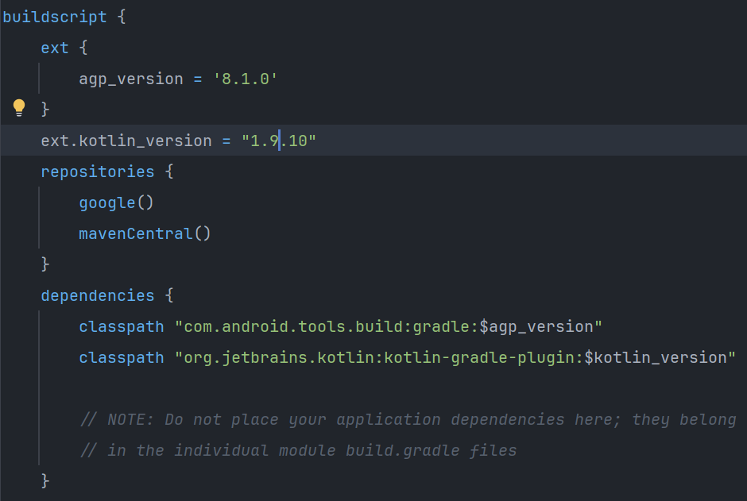
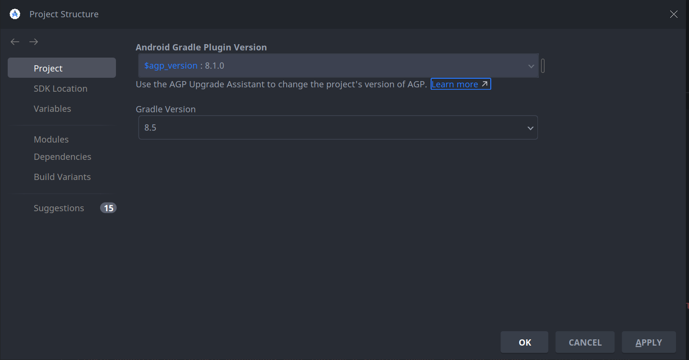
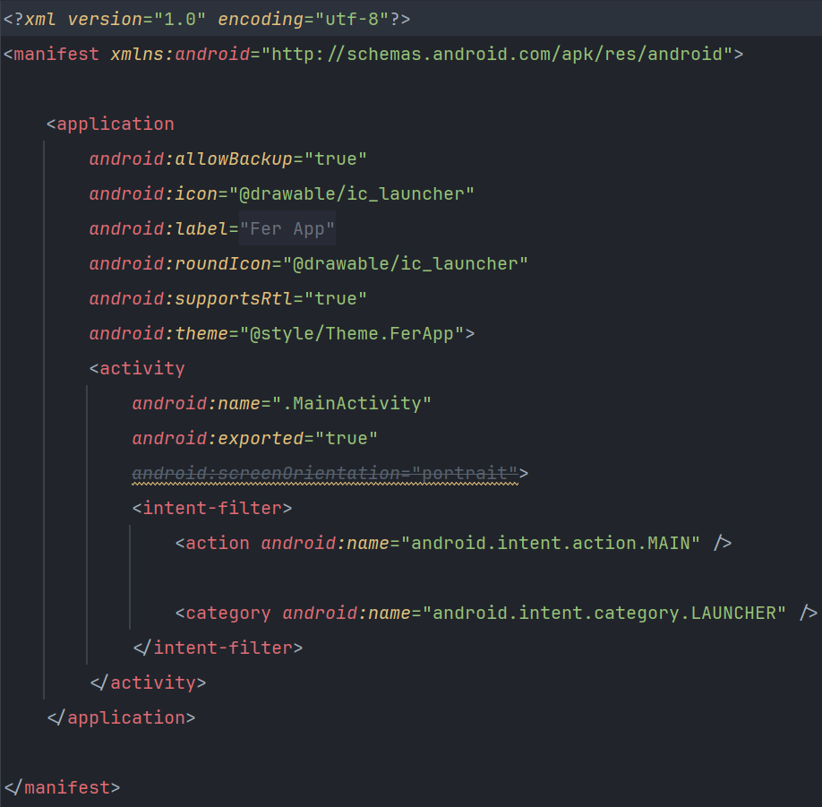
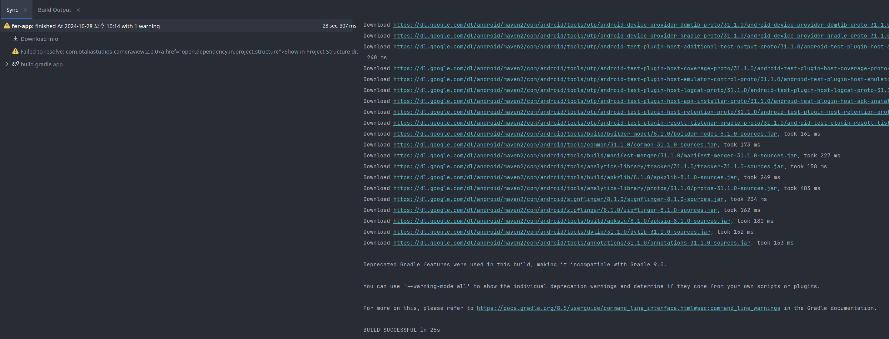

- toc
{:toc .large-only}

## 배경

프로젝트에 들어갈 기능이 구현된 유사한 앱을 테스트 해보기 위해 Clone을 받고 Android Studio로 Open을 하니

{:.lead lazy}
Gradle Version 충돌로 인한 Build Failed
{:.figcaption}

와 같은 창이 뜨며 Build에 실패했다   
현재 Android Studio LadyBug | 2024.2.1 Patch 1 버전을 사용하고 있었다

LadyBug가 나온지 얼마 되지 않은 버전이었다보니 어쩔 수 없는 일이었다   
나중에 또 다시 같은 충돌이 일어나고 문제가 일어날 경우를 대비해 오늘의 해결 과정을 기록한다

## Build Gradle Version 올리기
오류를 읽어보니 LadyBug는 기본적으로 Gradle Version이 8.5 이상이었던 것 같다   
조금이라도 오류가 덜 나길 바라는 마음에 Gradle Version을 8.9로 할 지, 8.5로 할 지 고민하다,   
아래의 Upgrade to Gradle 8.5 and re-sync를 실행했다   

{:.lead lazy}
Configuration Error로 인한 Build Failed
{:.figcaption}

다만 위와 같은 에러가 발생했고, 솔직히 확실하진 않지만 이 부분은 Kotlin Version 문제인 것으로 추정되었다(그냥 AGP만의 문제였을 수도..?)   
Clone 받은 Project의 Kotlin Version은 현재 1.4.10이었고 1.9.10으로 바꿔주었다   
또한 **Project gradle의** dependencies내에 jcenter를 mavenCentral로 바꾸었다   
그리고 AGP의 Version 또한 8.1로 설정하였다   

다만 제대로 범위를 확인해보지는 않았지만 Gradle과 호환되는 Version이라면 더 최신 아니면 구버전을 써도 크게 문제 없을 듯 하다
{:.faded}   
Gradle의 Version을 올리게 되면서 <U>kotlin-android-extensions</U>은 더 이상 사용되지 않기 때문에,   
**App 모듈의 Gradle**에서 kotlin-android-extensions를 제거한 뒤 다시 빌드를 돌렸다   

{:.lead lazy}
Project Module Gradle 설정
{:.figcaption}
{:.lead lazy}
AGP Version 설정
{:.figcaption}

## NameSpace 설정
이후 에러로는 namespace였다   
과거에는 namespace를 Android Manifest에 적었던 것 같지만 이제는 각 Module의 Gradle 내의 android 스코프 내에 적어야 한다  
또한 activity가 exported 설정이 되어야 하므로 같이 진행해주었다 
이미 Android Manifest에 있는 package로 적혀있는 값을 가져오고, Manifest에서는 지워주고 다시 빌드를 돌린다   

본 프로젝트에서는 Module이 두개였기 때문에 두개 전부 진행하였다 모듈 수는 프로젝트마다 다르니 확인하고 진행해야 한다
{:.note title="Note"}

{:.lead lazy}
여기서 package로 써져 있는 것이 namespace가 된다
{:.figcaption}   
{:.lead lazy}
android:exported를 true로 설정해준다
{:.figcaption}

## 결과
{:.lead lazy}
Build Success...!
{:.figcaption}

다만 이번 예시로 작업한 Project는 더 작업할 것이 있었는데,    
왜인지 모르겠지만 Project 내에서 쓰던 라이브러리의 버전이 제대로 설정되어 있지 않았다   

위에 Success 사진을 보면 묘하게 Failed 기록 하나가 남아있다
{:.faded}   
또한 XML내의 id로 참조하는 View를 가져오지 않고서 관련 코드를 작성하여,   
findViewById로 매핑을 시킨 후 돌려서 정상 작동하는 모습을 볼 수 있었다   

LadyBug로 올린 뒤 3년 정도 된 Project를 받아서 테스트 시도를 해볼 때마다,   
아래와 같은 오류가 터지며 너무 고통스러웠는데 이제 좀 나아지길 바란다